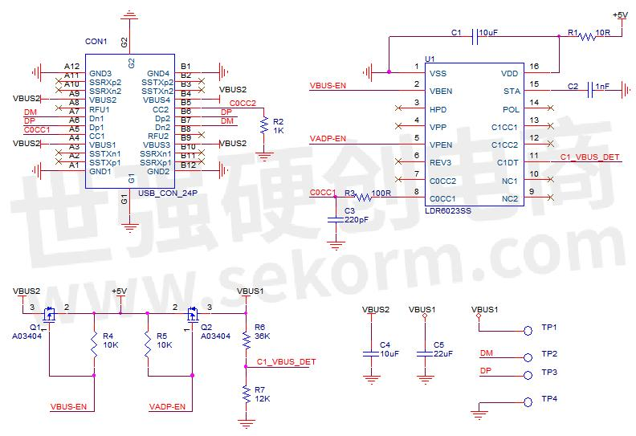

# CP2104 USB Serial with PD source

This project is the result of research for 2 things, USB serial data for Android devices and being able to charge using a valid PD protocol. Common Type-C cables include two types: dual-head Type-C interface (full function) and Type-A to Type-C interface. The dual-head Type-C interface cable is too expensive and has limited usage scenarios, so Type-A to Type-C cable still has a large market. Type-A to Type-C cables are divided into two types: charging only and charging and data transmission. This article introduces a cable that can both charge and transmit data using the LDR6023SS USB PD communication chip from Lederer . It is simple in design and low in cost.

### Main functions of LDR6023:

1. Support USB PD 2.0, compatible with USB PD 3.0.
2. Support two USB-C DRP ports.
3. Support transparent transmission of PDO and REQUEST negotiation between the adapter and the smart device.
4. Automatically switch between DR_SWAP and UFP modes.

### Example simple schematic:

Since it is applied to wires, the chip package should be as small as possible. The smallest package of the LDR6023 series is SSOP-16, and the specific model is LDR6023SS. The schematic diagram is shown in Figure 1:

### Link:

I found all this documentation from chinnese web. Please use google translate or somehing: 

1. https://www.sekorm.com/news/76945168.html
